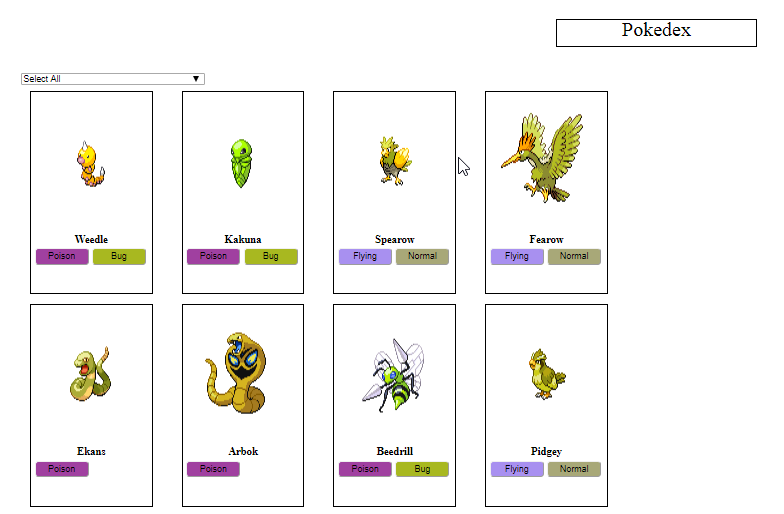

# Pokemon Api
The page displays information about Pokémon. 

Information on all Pokémon is available via the link [pokeapi](https://pokeapi.co/docs/v2.html).

## The page is accessible to the user: ##

+When you load a page, you will see 12 different Pokémon that can be accessed from the link [AllPokemon](https://pokeapi.co/api/v2/pokemon):

https://olenapauk.github.io/Pokemon_Api/

