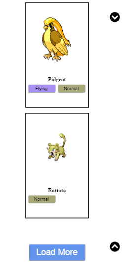
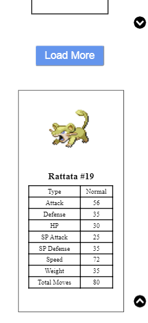
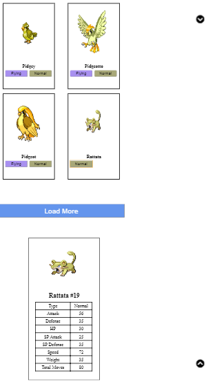

# Poke wiki
On this page You can find information about all Pokémons.

Poke API [link](https://pokeapi.co/docs/v2.html) provides simple API for pokemons seach, pokemons info, etc.

# Application description 

+ For Pokémons list we use APi url: https://pokeapi.co/api/v2/pokemon?limit=12&offset=1 were limit end offset are selecting parameters. By default we select 12 Pokémons.

+ Filtering by Pokémons type display only selected type Pokémons for all loaded before.

Filtered Pokémons.

+ To see Pokémon info just click on Pokémon.

+ For load more Pokémons on the page, you can to click the button ***'Load More'***.

+ ***'Top'*** and ***'Down'*** buttons. 

+ This page has a responsive design, so it will be easy to use on your mobile phone or tablet. Detailed info about the Pokémon is after ***'Load More'*** button, use ***'Down'*** button to scroll page to the Pokémon info.

## [Demo page by](https://olenapauk.github.io/Pokemon_Api/)

