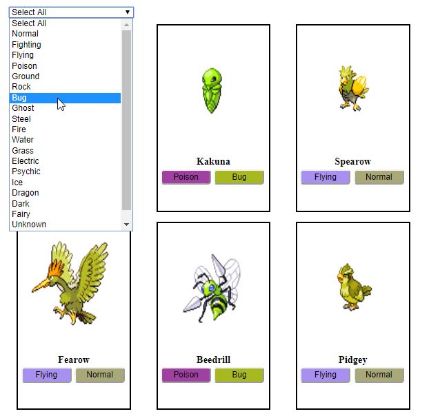

# Pokemon Api
The page displays information about Pokémon. 

Information on all Pokémon is available via the link [pokeapi](https://pokeapi.co/docs/v2.html).

## The page is accessible to the user: ##

+ When you load a page, you will see 12 different Pokémon that can be accessed from the link [AllPokemon](https://pokeapi.co/api/v2/pokemon):

+ After clicking on the drop-down list, the user can choose which type of Pokemon to display on the page(fire,normal etc) 

+ In order to obtain detailed information about a particular Pokémon, you must click on the Pokémon image or the button corresponding to the type of attack

+ If you want to display more Pokémon on the page, you need to click the button ***'Load More'***. After that, some more new Pokémon will appear on the page

+ To quickly return to the beginning of the page, in the lower right corner there is a button ***'Top'***, when you press the page scroll up

## The page view is available via the link

[PokemonApi](https://olenapauk.github.io/Pokemon_Api/)

